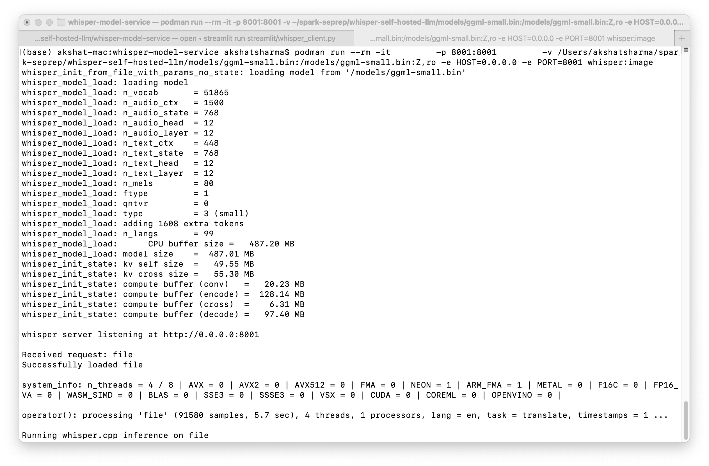
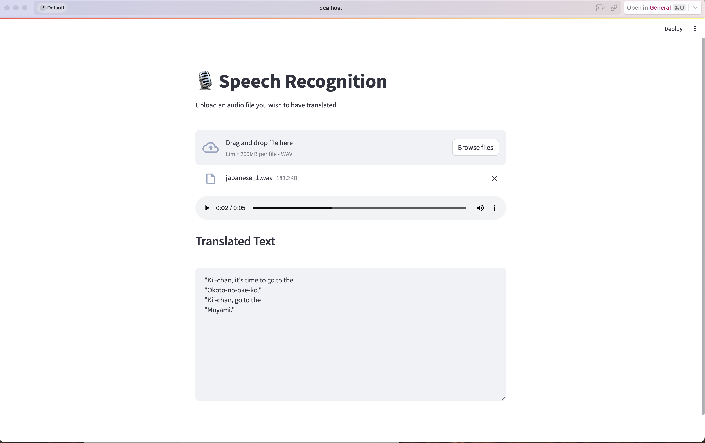

## Assignment 8: Selfhost LLM
### Name: akshat sharma
### Email: akshat14@bu.edu

1. Add a terminal screenshot of the server hosted on your machine.

2. Add a streamlit UI screenshot with an audio transcription.

3. Add notes and challenges.

**Bug in Podman (Version 5.0.0):**
- Upon initiating the assignment, i discovered that Podman version 5.0.0 has a critical bug. This bug rendered it impossible to run images on my machine.I was also getting unmarshalling error which was also related to my version of Podman. This is a repository that addresses the issue https://github.com/containers/podman/issues/20821
- To address this, I had to uninstall podman 5.0.0 and reinstall podman 5.0.2 on my machine.

**Missing several packages to use the model:**
- My machine didn't have several essential packages required for self-hosting the LLM.
- Additionally, my current Python version wasn't compatible with the LLM and its dependencies.
- Thus, I upgraded Python to a version compatible with the LLM and its associated dependencies.
  
**Below are the commands that i used to run the whisper image:**
 podman run --rm -it         -p 8001:8001         -v /Users/akshatshaseprep/whisper-self-hosted-llm/models/ggml-small.bin:/models/ggml-small.bin:Z,ro -e HOST=0.0.0.0 -e PORT=8001 whisper:image